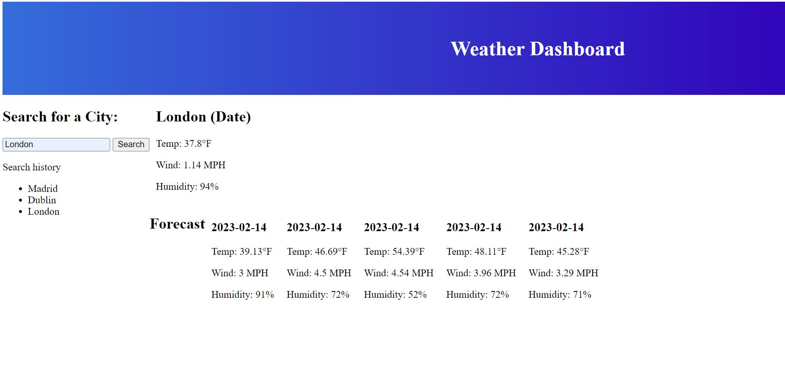

# Checking_The_Weather

## Description

When a user loads the page they are presented with the option to search for a city. When the city is entered the days forecast and the next five days load on the page.

## Links

Link to the repository - https://github.com/Daniel-robe/Checking_The_Weather

Link to the live site - https://daniel-robe.github.io/Checking_The_Weather/

## Screenshot

